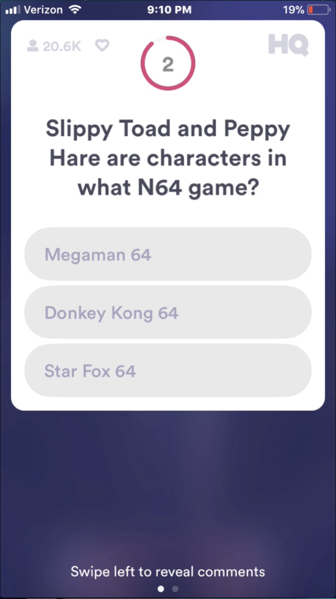
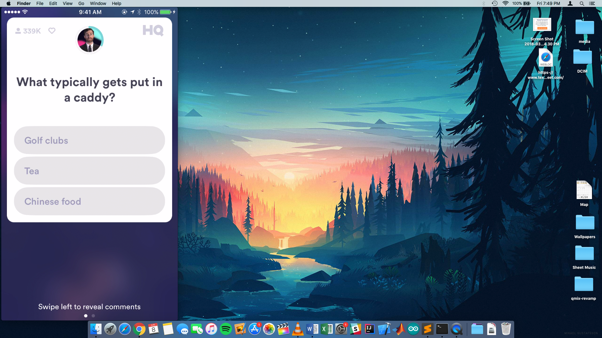
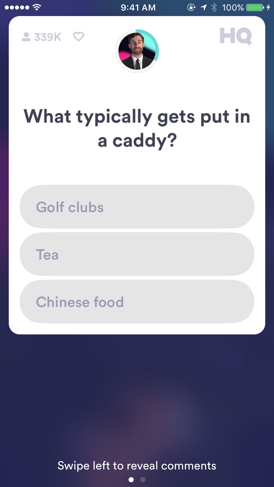
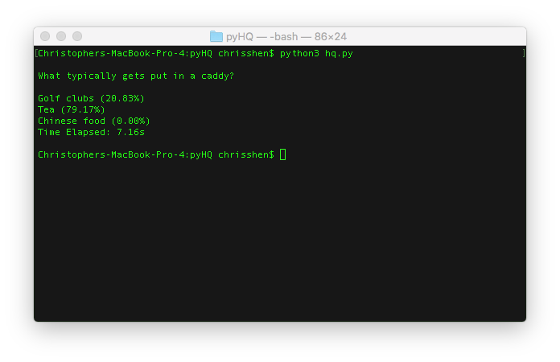
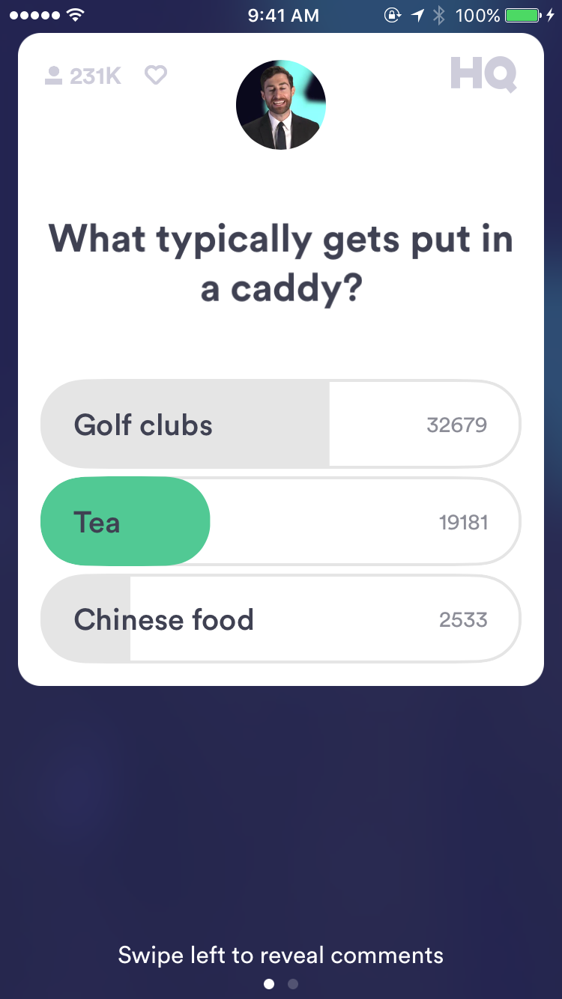

# myHQBot
A basic trivia answering script. Supports [HQ Trivia](https://itunes.apple.com/us/app/hq-live-trivia-game-show/id1232278996?mt=8) and related games i.e. [Cash Show](https://itunes.apple.com/us/app/cash-show-win-real-cash/id1335097700?mt=8), [Genius](https://genius-quiz.com/), and [QuizBiz](https://twitter.com/quizbizlive?lang=en).

### HQ Trivia
Hq Trivia is a live game show app that gives away money daily if you can answer 12 multiple choice questions correctly.

### About
There are two versions of the script, one written in MATLAB and one written in Python 3.  The MATLAB script is more robust and has more optimizations whereas the python script is more barebones, so I would recommend you check out the MATLAB script first is you have MATLAB installed.

### Setup
This script requires you to mirror your iPhone to your computer (Unix/Mac support only).  Once this is is accomplished, position the mirror on the left side of your desktop and run either script. 

### How it Works
1. Mirror phone screen to desktop.
2. Screenshot current question.
3. Rasterize the image.
4. Run OCR on the image to get relevant text (Tesseract).
5. Create google search query and webscrape.
6. Perform a weighted string search count on the parsed text.
7. Return most probable answer.

### Performance
Performance is highly dependent on internet connection.  The python script is slower and needs more optimization.  This is due to the fact that BeautifulSoup creates a parse tree on the entire HTML text, which is very computationally expensive and not entirely necessary.  

## Preview
 

